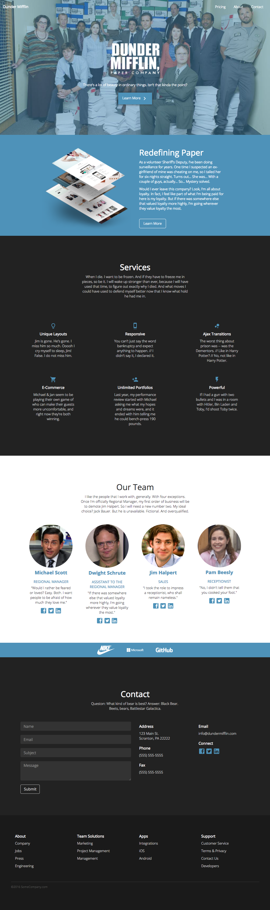

# Home Page Test

####[View here](https://kimhart.github.io/homepage_test/)

This home page follows the styling specifications from the SomeCompany example, but with a Dunder Mifflin theme. 

Normally I'd spin up a Node server and use either Gulp or a webpack/React build and do all my styling in Sass. However, because it was meant to be mostly static, I went with straight CSS in the interest of time. (Which is actually hard to keep tidy, after using Sass and other tools.)

The JS file only contains some jQuery to determine which device is being used. It then determines if the navbar should be fixed to the top of the screen assigning Bootstrap's built-in ```navbar-fixed-to-top``` class.

Google Fonts & Google Material Icons were used for all icons on this page.

| Suggested Style | My Challenge |
| ------------- | ------------- |
|  |   |

